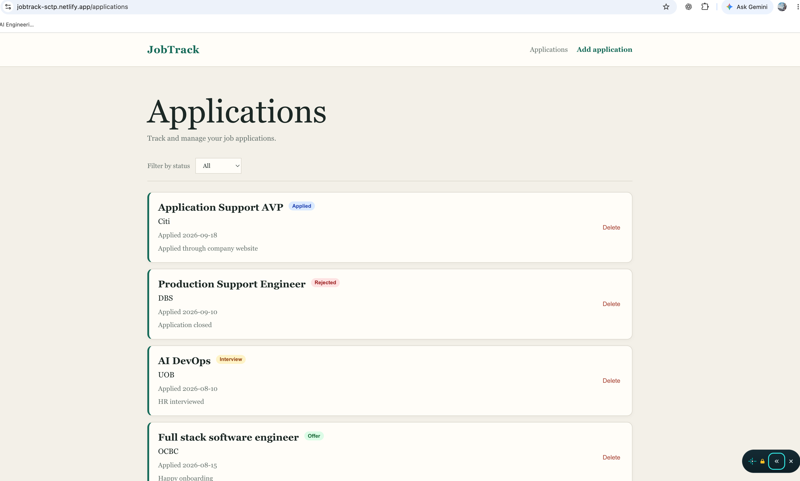
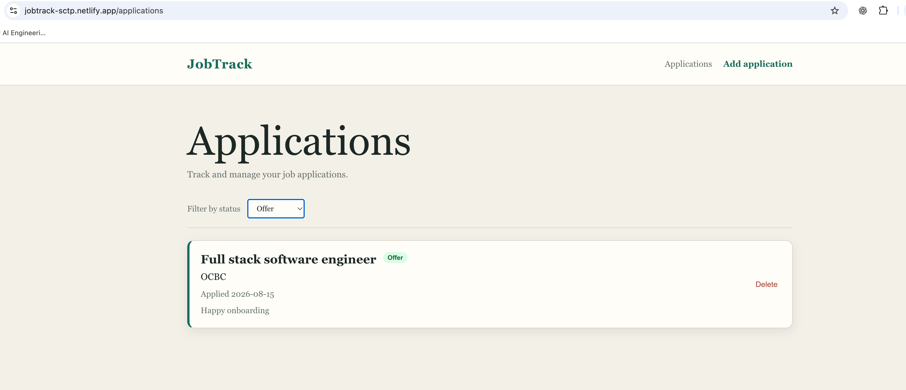
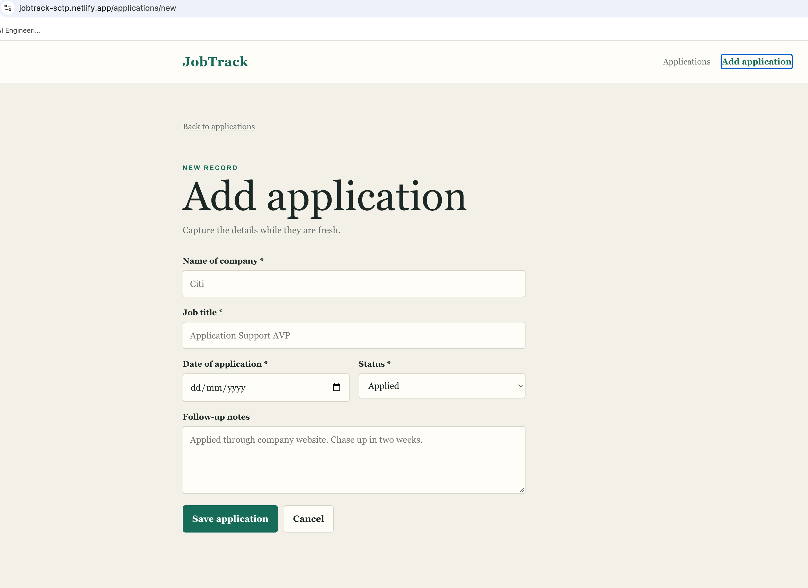
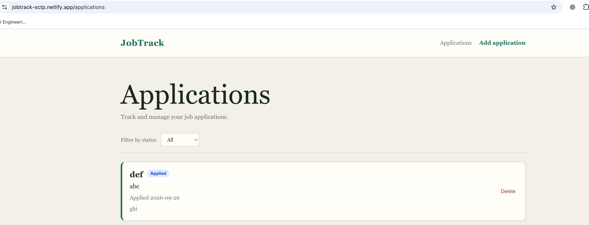

# JobTrack

JobTrack is a React-based job application tracker that helps users record, view, filter, and delete job applications in one place.

It was built as part of the NTU SCTP Module 2 React Group Project.

## Live Demo

https://jobtrack-sctp.netlify.app

## Team Members

- Johnson Zhang Xun
- Kenneth Kong Jin Quan

## Work Division

### Johnson Zhang Xun

- `ApplicationsPage`
- `ApplicationList`
- `ApplicationCard`
- MockAPI GET integration
- MockAPI DELETE integration
- Status filtering
- Loading, error, and empty states
- Applications list page styling

### Kenneth Kong Jin Quan

- `AddApplicationPage`
- `ApplicationForm`
- Controlled form inputs
- Required-field validation
- MockAPI POST integration
- Submission/loading feedback
- Responsive layout for mobile screen widths

### Shared Work

- Shared application state in `App.jsx`
- React Router integration
- Shared navigation
- Integration of GET, POST, and DELETE flows
- Manual end-to-end verification
- Netlify deployment
- Documentation and presentation preparation

## Features

- View all job applications
- Add a new job application
- Delete an existing application
- Filter applications by status:
  - Applied
  - Interview
  - Offer
  - Rejected
- Persist data using MockAPI
- Loading and error handling
- Controlled form validation
- Client-side routing
- Responsive layout for mobile screen widths

## Data Model

```json
{
  "id": "1",
  "company": "Citi",
  "jobTitle": "Application Support AVP",
  "status": "Applied",
  "appliedDate": "2026-09-20",
  "notes": "Applied through company website"
}
```

MockAPI generates the `id`. Company, job title, status, and applied date are required. Notes are optional.

## Routes

| Route | Purpose |
| --- | --- |
| `/applications` | View, filter, and delete applications |
| `/applications/new` | Add a new application |

The root route redirects to `/applications`.

## Tech Stack

- React
- Vite
- JavaScript
- React Router
- MockAPI
- CSS
- Git / GitHub
- Netlify

## Run Locally

Clone the repository and install dependencies:

```bash
npm install
```

Start the development server:

```bash
npm run dev
```

Open the local URL shown by Vite in the terminal.

## Production Build

```bash
npm run build
```

The production files are generated in the `dist` directory.

## Deployment

The project is deployed on Netlify:

https://jobtrack-sctp.netlify.app

A Netlify SPA redirect is included so React Router routes such as `/applications` and `/applications/new` work correctly when opened or refreshed directly.

## Screenshots

### Applications List



### Status Filtering



### Add Application



### Created Application



An additional form-entry screenshot is stored at:

`docs/screenshots/create-application-form.png`

## Bonus Challenges

Completed bonus-style enhancements include:

- Status filtering
- Responsive layout

## AI and Tools Disclosure

AI tools were used to support development, debugging, code review, and documentation.

Tools used included:

- **ChatGPT** — planning, debugging, integration guidance, and documentation support
- **GitHub Copilot** — code suggestions and pull request review
- **VS Code** — development environment
- **GitHub** — version control, feature branches, pull requests, and collaboration
- **MockAPI** — hosted mock backend
- **Netlify** — public deployment

All final code was reviewed and tested by the team, and team members are expected to be able to explain the codebase.

## Project Status

Core functionality is complete and deployed.

Remaining work is limited to final documentation, presentation preparation, and any final regression checks.
